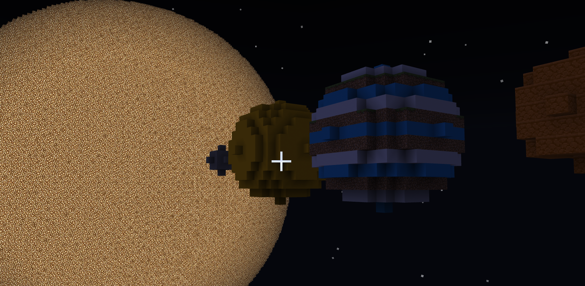

## MakeCode for Minecraft Education Extension

This repository is an approved **extension** in Makecode for Minecraft Education. 

## Overview

This extension holds anything space! The blocks in this extension can help you build your own solar system or individual planets! There are a lot of other celestial bodies that you may want to build in class as well, so you can also make your own spheres!

Running these blocks will start building whatever planet or celestial body you specify.

**Note** 
The solar system and the planets are large!! This extension builds the planets and solar system for you, but it will take some time. 