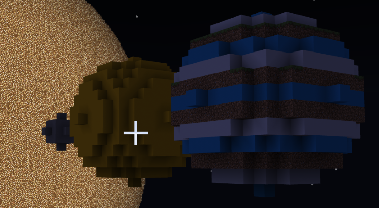

## MakeCode for Minecraft Education Extension

This repository is an approved **extension** in Microsoft MakeCode for Minecraft Education. 

## Overview

This extension holds anything space! The blocks in this extension can help you build your own solar system or individual planets! There are a lot of other celestial bodies that you may want to build in class as well, so you can also make your own spheres!

Running these blocks will start building whatever planet or celestial body you specify.

**Note** 
The solar system and the planets are large!! This extension builds the planets and solar system for you, but it will take some time.

## Contributors
We want to express our gratitude to the following individuals who have contributed to this project:
- [@maheshmj24](https://github.com/maheshmj24)

Thanks for your valuable contributions! Your help has been greatly appreciated!

## Contributing

This project welcomes contributions and suggestions.  Most contributions require you to agree to a
Contributor License Agreement (CLA) declaring that you have the right to, and actually do, grant us
the rights to use your contribution. For details, visit https://cla.opensource.microsoft.com.

When you submit a pull request, a CLA bot will automatically determine whether you need to provide
a CLA and decorate the PR appropriately (e.g., status check, comment). Simply follow the instructions
provided by the bot. You will only need to do this once across all repos using our CLA.

This project has adopted the [Microsoft Open Source Code of Conduct](https://opensource.microsoft.com/codeofconduct/).
For more information see the [Code of Conduct FAQ](https://opensource.microsoft.com/codeofconduct/faq/) or
contact [opencode@microsoft.com](mailto:opencode@microsoft.com) with any additional questions or comments.

## Trademarks

This project may contain trademarks or logos for projects, products, or services. Authorized use of Microsoft 
trademarks or logos is subject to and must follow 
[Microsoft's Trademark & Brand Guidelines](https://www.microsoft.com/en-us/legal/intellectualproperty/trademarks/usage/general).
Use of Microsoft trademarks or logos in modified versions of this project must not cause confusion or imply Microsoft sponsorship.
Any use of third-party trademarks or logos are subject to those third-party's policies.